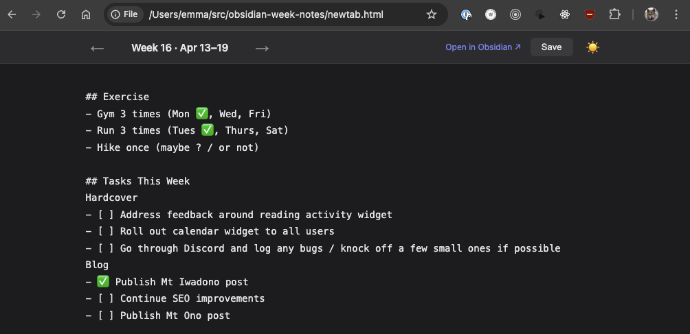

# Obsidian Week Notes

This setup lets you see and edit your Obsidian week notes from your browser's new tab.

You can navigate back and forth between previous week notes, and if you are on a new week, a new note will automatically be created.



## Requirements

1. Install the [Local REST API](https://github.com/coddingtonbear/obsidian-local-rest-api) plugin in Obsidian. This is required to write to the Obsidian file.
    - To install a plugin in Obsidian, go to `Settings > Community Plugins`
2. Enable the plugin, grab the API key from its settings.
3. In the `newtab.html` file, you will need to fill out some config settings
```
const OBSIDIAN_API = "https://localhost:27124";
const API_KEY      = "<key-goes-here>";
const VAULT_FOLDER = "notes/week-notes";  
const VAULT_NAME   = "vault";
```

3. Install a new tab browser extension (e.g. [Custom New Tab URL](https://chromewebstore.google.com/detail/custom-new-tab-url/mmjbdbjnoablegbkcklggeknkfcjkjia) for Chrome) and set the new tab URL to `file:///path/to/newtab.html`. You'll need to enable the `Allow access to file URLs` in the browser extension settings.
4. Visit https://localhost:27124 in the browser and accept the self-signed cert.